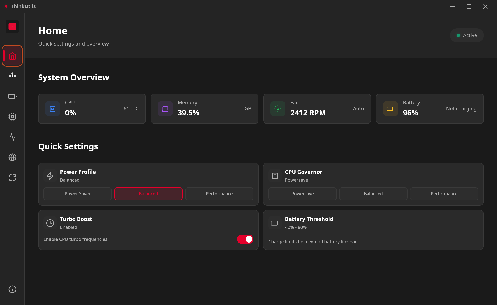
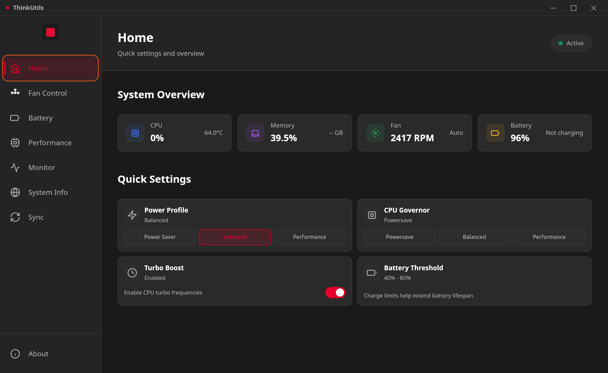
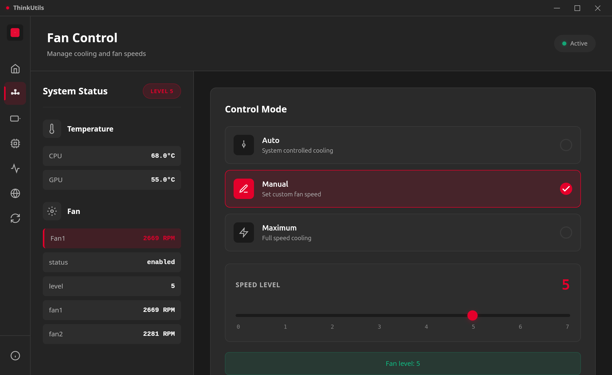

# ThinkUtils

A powerful, native desktop application that unlocks the full potential of your ThinkPad on Linux. Built with Tauri for blazing-fast performance, ThinkUtils gives you complete control over fan speeds, battery health, CPU performance, and system monitoring—all through a sleek, modern interface inspired by ThinkPad's iconic design.


## Screenshots

### Home Dashboard


### Extended Home View


### Fan Control


### Performance Tuning


### System Monitor


### System Information


### Settings Sync


## Features

### 🏠 Home Dashboard
Your command center for quick system adjustments. The home dashboard provides real-time monitoring and quick access to essential controls.

- **System Overview**: Real-time monitoring of CPU usage and temperature, memory usage, fan speed and mode, battery level and status
- **Power Profile Control**: Instantly switch between Power Saver, Balanced, and Performance modes to match your workflow
- **CPU Governor**: Quick access to change CPU frequency scaling policy (Powersave, Balanced, Performance)
- **Turbo Boost Toggle**: Enable or disable CPU turbo frequencies with a single click
- **Battery Threshold Display**: View current charge limit settings (e.g., 40%-80%) configured for battery longevity

### 🌀 Fan Control
Take control of your ThinkPad's legendary cooling system. Whether you need whisper-quiet operation in a library or maximum cooling for intensive workloads, ThinkUtils gives you precise control.

- **Real-time Monitoring**: Watch CPU/GPU temperatures and fan RPM update live—know exactly what's happening inside your machine
- **Multiple Control Modes**:
  - **Auto Mode**: Let the system intelligently manage cooling based on temperature (recommended for most users)
  - **Manual Mode**: Set precise fan speed levels from 0 (silent) to 7 (maximum)—perfect for finding the sweet spot between noise and cooling
  - **Maximum Mode**: Run fans at full blast for intensive tasks like video rendering or gaming
- **Temperature Sensors**: Monitor every thermal sensor in your system—CPU cores, GPU, battery, and more
- **Permission Management**: Secure, one-time elevated access using pkexec—no need to run the entire app as root

### 🔋 Battery Management
Extend your battery's lifespan by years with intelligent charge management. ThinkUtils helps you implement the 40-80 rule that professionals use to maximize battery longevity.

- **Multi-Battery Support**: Monitor all installed batteries—perfect for ThinkPads with dual battery setups
- **Charge Thresholds**: Set custom start/stop charging limits (e.g., start at 40%, stop at 80%) to dramatically reduce battery wear and extend its useful life
- **Battery Health**: Track capacity degradation, health percentage, and total charge cycles—know when it's time for a replacement
- **Real-time Stats**: Monitor current charge level, voltage, power draw, and estimated time remaining

### ⚡ Performance Tuning
Squeeze every drop of performance from your CPU or maximize battery life—your choice. Fine-tune how your ThinkPad manages processor power and frequency scaling.

- **CPU Governor Control**: Choose your scaling policy—performance for maximum speed, powersave for battery life, schedutil for intelligent scheduling, or ondemand for dynamic adjustment
- **Power Profiles**: System-wide power management profiles that coordinate CPU, GPU, and other components for optimal performance or efficiency
- **Turbo Boost**: Toggle Intel Turbo Boost on/off—disable it to reduce heat and power consumption, or enable it for burst performance
- **Frequency Monitoring**: Watch your CPU frequency scale in real-time and see min/max ranges for each core

### 📊 System Monitor
A comprehensive system dashboard that shows you everything happening on your ThinkPad. No need for multiple terminal windows—get all your metrics in one beautiful interface.

- **CPU Usage**: Per-core utilization with frequency display and 1/5/15 minute load averages—spot bottlenecks instantly
- **Memory Stats**: RAM and swap usage with detailed breakdowns of used, available, and total memory
- **Disk Usage**: Monitor space usage across all mounted filesystems with device names and mount points
- **Network Activity**: Total bytes and packets transmitted/received for each network interface
- **Process Monitor**: View top processes by CPU and memory consumption with PID, name, and status

### 💻 System Information
Know your machine inside and out. Quick access to all your ThinkPad's hardware specifications and system details.

- **Hardware Details**: Complete specs including ThinkPad model, CPU type, total memory, and operating system
- **Kernel Version**: Current Linux kernel version—useful for troubleshooting compatibility
- **Hostname**: System identification for network management

### 🔄 Google Drive Sync
Never lose your carefully tuned settings. Sync your ThinkUtils configuration to the cloud and restore it on any ThinkPad.

- **Settings Backup**: Sync your fan mode, battery thresholds, and application preferences to Google Drive
- **Cross-Device**: Switch between multiple ThinkPads? Keep your settings consistent across all your machines
- **OAuth Integration**: Secure authentication using Google's OAuth—your credentials never touch ThinkUtils servers
- **Note**: Requires Google OAuth credentials to be configured (see GOOGLE_OAUTH_SETUP.md)

### 🎨 Modern UI
A beautiful interface that feels right at home on your ThinkPad. Inspired by ThinkPad's iconic design language with modern touches.

- **Dark Theme**: Easy on the eyes with a sleek dark interface accented by ThinkPad's signature red—perfect for late-night work sessions
- **Custom Titlebar**: Frameless window design with native controls that integrates seamlessly with your desktop environment
- **Responsive Design**: Clean, organized layout that makes complex system controls feel intuitive and accessible
- **Real-time Updates**: All metrics refresh automatically—no manual refreshing needed

## How it Works

ThinkUtils combines the performance of Rust with the flexibility of web technologies to deliver a native desktop experience:

- **Rust backend** provides blazing-fast system access and direct hardware control with minimal overhead
- **sensors command** (lm-sensors) reads temperature data from all available thermal sensors
- **/proc/acpi/ibm/fan** interface gives direct access to ThinkPad's fan controller via the thinkpad_acpi kernel module
- **pkexec** handles elevated permissions securely—only specific operations require root access, not the entire application

## Prerequisites

### Debian / Ubuntu
```bash
sudo apt install lm-sensors policykit-1
```

### Fedora / RHEL
```bash
sudo dnf install lm_sensors polkit
```

### Arch Linux
```bash
sudo pacman -S lm_sensors polkit
```

## Setup ThinkPad Fan Control

Before using ThinkUtils, you need to enable fan control:

1. Create or edit the thinkpad_acpi configuration:
```bash
sudo nano /etc/modprobe.d/thinkpad_acpi.conf
```

2. Add this line:
```
options thinkpad_acpi fan_control=1
```

3. Reboot your system or reload the module:
```bash
sudo modprobe -r thinkpad_acpi
sudo modprobe thinkpad_acpi
```

## Development

### Prerequisites
- Rust (1.70 or later)
- Node.js and npm
- Development dependencies for your distribution

**Debian/Ubuntu:**
```bash
sudo apt install libwebkit2gtk-4.1-dev \
    build-essential \
    curl \
    wget \
    file \
    libssl-dev \
    libayatana-appindicator3-dev \
    librsvg2-dev
```

**Fedora:**
```bash
sudo dnf install webkit2gtk4.1-devel \
    openssl-devel \
    curl \
    wget \
    file \
    libappindicator-gtk3-devel \
    librsvg2-devel
```

### Getting Started

1. **Clone and install dependencies:**
```bash
git clone https://github.com/vietanhdev/ThinkUtils.git
cd thinkutils
npm install
```

2. **Run in development mode:**
```bash
npm run tauri dev
```

3. **Build for production:**
```bash
npm run tauri build
```

The built packages will be in `src-tauri/target/release/bundle/`

### Code Quality & Linting

ThinkUtils uses comprehensive linting and formatting tools to maintain code quality:

- **ESLint** - JavaScript linting
- **HTMLHint** - HTML validation
- **Stylelint** - CSS linting
- **Prettier** - Code formatting
- **Husky** - Git hooks for pre-commit checks
- **lint-staged** - Run linters on staged files only

#### Available Commands

```bash
# Run all linters
npm run lint

# Auto-fix issues
npm run lint:fix

# Format all files
npm run format

# Full validation (lint + format check)
npm run validate
```

#### Pre-commit Hooks

Pre-commit hooks are automatically set up when you run `npm install`. They will:

1. ✅ **Auto-format** staged files (JavaScript, HTML, CSS, JSON)
2. ✅ **Lint** staged files and fix auto-fixable issues
3. ✅ **Validate** all code before allowing commit
4. ❌ **Block commit** if linting fails

**What happens on commit:**
```bash
git commit -m "Your message"

🔍 Running pre-commit checks...
📝 Formatting and linting staged files...
  ✓ JavaScript files formatted and linted
  ✓ CSS files formatted and linted
  ✓ HTML files validated
✅ All checks passed!
```

**If issues are found:**
```bash
❌ Linting failed. Please fix the issues and try again.
```

The commit will be blocked until you fix the issues. Most issues can be auto-fixed:
```bash
npm run lint:fix
git add .
git commit -m "Your message"
```

#### IDE Integration

**VS Code** (Recommended):
1. Install recommended extensions (popup will appear)
2. Reload VS Code
3. Files will auto-format on save!

Recommended extensions:
- ESLint
- Prettier
- HTMLHint
- Stylelint

**Other IDEs:**
See `LINTING_SETUP.md` for configuration instructions.

#### Bypassing Pre-commit Hooks

In rare cases where you need to bypass hooks (not recommended):
```bash
git commit --no-verify -m "Your message"
```

### Project Structure

```
thinkutils/
├── src/                    # Frontend
│   ├── index.html         # Main UI
│   ├── styles.css         # Styling
│   └── js/                # Modular JavaScript
│       ├── app.js         # Main entry point
│       ├── dom.js         # DOM references
│       ├── state.js       # State management
│       ├── utils.js       # Utilities
│       ├── navigation.js  # View switching
│       ├── titlebar.js    # Window controls
│       ├── about.js       # About dialog
│       └── views/         # Feature modules
│           ├── home.js
│           ├── fan.js
│           ├── battery.js
│           ├── performance.js
│           ├── monitor.js
│           ├── sync.js
│           └── system.js
├── src-tauri/             # Backend (Rust)
│   ├── src/
│   │   └── lib.rs         # Tauri commands
│   └── tauri.conf.json    # Configuration
├── .husky/                # Git hooks
│   └── pre-commit         # Pre-commit validation
├── .eslintrc.json         # ESLint config
├── .prettierrc.json       # Prettier config
├── .stylelintrc.json      # Stylelint config
├── .htmlhintrc            # HTMLHint config
└── .lintstagedrc.json     # lint-staged config
```

### Development Workflow

1. **Create a feature branch:**
```bash
git checkout -b feature/your-feature
```

2. **Make your changes:**
   - Edit files in `src/` for frontend
   - Edit files in `src-tauri/src/` for backend

3. **Test your changes:**
```bash
npm run tauri dev
```

4. **Validate code quality:**
```bash
npm run validate
```

5. **Commit your changes:**
```bash
git add .
git commit -m "feat: add your feature"
```
   - Pre-commit hooks will automatically format and lint
   - Commit will be blocked if validation fails

6. **Push and create PR:**
```bash
git push origin feature/your-feature
```

### Coding Standards

- **JavaScript**: ES6+ modules, single quotes, semicolons
- **HTML**: HTML5, lowercase tags, double quotes for attributes
- **CSS**: Standard CSS, consistent spacing
- **Formatting**: 2-space indentation, LF line endings
- **Commits**: Follow [Conventional Commits](https://www.conventionalcommits.org/)

### Testing

```bash
# Run linters
npm run lint

# Run auto-fix
npm run lint:fix

# Full validation
npm run validate
```

### Documentation

- `src/js/README.md` - JavaScript module documentation
- `docs/` - Feature documentation

## Usage

### Running the Application

Launch ThinkUtils from your application menu or run:
```bash
thinkutils
```

### Navigation

Use the left sidebar to navigate between features:
- **Home**: Quick settings and system overview
- **Fan Control**: Manage cooling and temperatures
- **Battery**: Battery health and charge thresholds
- **Performance**: CPU governor and power profiles
- **Monitor**: Real-time system resource monitoring
- **System Info**: Hardware and OS details
- **Sync**: Google Drive settings backup
- **About**: Application information

### Home Dashboard

The home screen provides quick access to essential controls:

1. **System Overview**: Monitor CPU usage/temperature, memory usage, fan speed, and battery level in real-time
2. **Power Profile**: Click buttons to switch between Power Saver, Balanced, or Performance modes
3. **CPU Governor**: Select CPU frequency scaling policy (Powersave, Balanced, Performance)
4. **Turbo Boost**: Toggle CPU turbo frequencies on/off with a switch
5. **Battery Threshold**: View current charge limit settings (configured in Battery view)

### Fan Control

Control your ThinkPad's cooling system:

1. **Auto Mode** (Default): System manages fan speed automatically
2. **Manual Mode**: Set specific fan level (0-7)
   - 0: Silent (lowest speed)
   - 7: Maximum speed
3. **Maximum Mode**: Run fan at full speed for intensive cooling

The status panel shows real-time temperature sensors and fan speeds.

### Battery Management

Optimize battery health and longevity:

1. View all installed batteries with current charge levels
2. Set **Start Charging** threshold (when to begin charging)
3. Set **Stop Charging** threshold (when to stop charging)
4. Click **Apply Thresholds** to save settings

**Recommended for longevity**: Start at 40%, Stop at 80%

### Performance Tuning

Optimize CPU performance and power consumption:

1. **CPU Governor**: Select scaling policy (performance, powersave, schedutil, etc.)
2. **Power Profile**: Choose system-wide power mode
3. **Turbo Boost**: Toggle CPU turbo frequencies on/off

Monitor current frequency and min/max ranges in real-time.

### System Monitor

Track system resources in real-time:

- **CPU**: Per-core usage with frequency and load averages (1/5/15 min)
- **Memory**: RAM and swap utilization with used/available/total breakdown
- **Disk**: Usage per mounted filesystem with device names
- **Network**: Total bytes and packets transmitted/received per interface
- **Processes**: Top processes by CPU/memory with PID, name, and status

All metrics update automatically every 2 seconds.

### Google Drive Sync

Backup and sync your settings:

1. Click **Sign in with Google** (requires OAuth configuration)
2. Authorize ThinkUtils to access Google Drive
3. Use **Sync Now** to backup current settings
4. Use **Download Settings** to restore from cloud

**Note**: Requires Google OAuth credentials configured in source code.

### Permissions

ThinkUtils may request elevated permissions for:
- Fan control access
- Battery threshold configuration
- CPU governor changes
- Power profile management

All requests are handled securely using `pkexec`.

## Compatibility

ThinkUtils is designed for IBM/Lenovo ThinkPad laptops running Linux.

**Tested on:**
- ThinkPad T480, T490, T14
- ThinkPad X1 Carbon (various generations)
- ThinkPad P-series workstations

**Requirements:**
- Linux kernel with thinkpad_acpi module
- /proc/acpi/ibm/fan interface available

## Troubleshooting

### Fan control not working
1. Verify thinkpad_acpi is loaded:
   ```bash
   lsmod | grep thinkpad_acpi
   ```
2. Check if fan control is enabled:
   ```bash
   cat /etc/modprobe.d/thinkpad_acpi.conf
   ```
3. Verify the file exists:
   ```bash
   ls -l /proc/acpi/ibm/fan
   ```

### Permission errors
ThinkUtils will automatically request elevated permissions. If issues persist:
```bash
sudo chmod 666 /proc/acpi/ibm/fan
```

Note: This needs to be done after each reboot unless you set up udev rules.

### No temperature data
Ensure lm-sensors is installed and configured:
```bash
sudo sensors-detect
sensors
```

## Project Structure

```
thinkutils/
├── src/                    # Frontend (HTML/CSS/JS)
│   ├── index.html         # Main UI with all views
│   ├── styles.css         # ThinkPad-themed dark styling
│   ├── main.js            # Application logic and Tauri commands
│   └── icons/             # SVG icons
│       └── fan.svg        # Custom fan icon
├── src-tauri/             # Backend (Rust)
│   ├── src/
│   │   └── lib.rs         # Tauri commands and system access
│   ├── tauri.conf.json    # Tauri configuration
│   └── icons/             # Application icons
├── ubuntu-installer.sh    # Package installation script
└── docs/                  # Documentation
    ├── THINKUTILS_MASTER_PLAN.md
    ├── IMPLEMENTATION_GUIDE.md
    ├── ROADMAP_VISUAL.md
    ├── FAN_CONTROL_FEATURE.md
    ├── BATTERY_FEATURE.md
    ├── PERFORMANCE_FEATURE.md
    └── MONITOR_FEATURE.md
```

## Contributing

Contributions are welcome! Areas for improvement:
- Additional ThinkPad utilities (battery, performance, etc.)
- Support for more ThinkPad models
- UI/UX enhancements
- Bug fixes and optimizations

## License

ThinkUtils is dual-licensed:

- **LGPL v3** - For open source projects
- **Commercial License** - For commercial/proprietary projects

For commercial licensing inquiries, please contact: https://www.vietanh.dev/contact

## Credits

- Built with [Tauri](https://tauri.app/)
- Icons from Lucide

## Disclaimer

ThinkUtils modifies system fan controls. While generally safe, use at your own risk. The authors are not responsible for any hardware damage that may occur from improper use.

**Always monitor temperatures when using manual fan control.**

---

**Made with ❤️ for ThinkPad enthusiasts**
